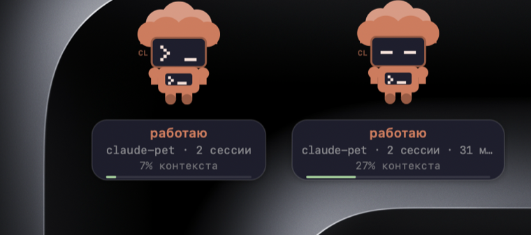

# Питомец для Claude Code

Робот на рабочем столе, который показывает, чем занят Claude Code: работает,
ждёт ответа, уперся в лимит или спит. Видно из любого приложения — окно живёт
поверх остальных и на всех рабочих столах.

Полезно, когда агент работает долго и терминал закрыт другими окнами: не нужно
переключаться, чтобы понять, ждёт он тебя или ещё думает.



## Что показывает

- **состояние**: работаю / жду ответа / лимит / сжимаю контекст / сплю;
- **чем занят прямо сейчас** — значок над головой: `>_` команда, ✎ правка файла,
  ⌕ поиск, ☁ сеть, ♧ подагенты;
- **сколько уже думает** — от минуты и дальше. Видно разницу между «две минуты»
  и «двадцать», если отходил;
- **проект** — подпись под фигуркой и две буквы на голове;
- **контекст** — процент и полоска, краснеет к концу;
- **лимит** пятичасового окна — вторая полоска, оранжевая с 60%, красная с 85%;
- **упавший инструмент** — питомец вздрагивает, подпись «упало: Bash»;
- **несколько сессий** — по фигурке на каждую, до четырёх в ряд.

Клик по фигурке открывает её сессию в терминале. Файл или папку можно бросить
на питомца: путь уйдёт в буфер, папка откроется новой сессией.

## Установка

Нужны macOS 13+, Command Line Tools (`xcode-select --install`) и `jq`.

```sh
git clone https://github.com/<ты>/claude-pet.git
cd claude-pet
./install.sh
```

Скрипт соберёт приложение, положит хуки в `~/.claude/hooks/` и допишет их
в `~/.claude/settings.json`. Чужие хуки в тех же событиях не затираются,
повторный запуск не плодит дубли, старый `settings.json` сохраняется рядом
с суффиксом `.bak-pet-<дата>`.

Питомец появится на столе, когда запустишь Claude Code. Меню — ромб «◆»
в строке состояния, выход оттуда же.

### Статусная строка (по желанию)

Проценты контекста, расход и лимиты приходят только статусной строке — хукам
Claude Code их не отдаёт. Без неё питомец работает, но эти цифры будут пустые.

```sh
cp statusline.sh ~/.claude/
```

и в `~/.claude/settings.json`:

```json
"statusLine": { "type": "command", "command": "~/.claude/statusline.sh" }
```

Расход в рублях по своей ставке — переменной `PET_RATE` (например `PET_RATE=85`).

### Автозапуск

```sh
cp local.claudepet.plist ~/Library/LaunchAgents/dev.claudepet.plist
launchctl bootstrap gui/$(id -u) ~/Library/LaunchAgents/dev.claudepet.plist
```

Если включил автозапуск — не запускай приложение руками, иначе будет две копии.
Вторая, впрочем, сама закроется: копии держат блокировку на `~/.claude/.pet.lock`.

## Как это работает

Claude Code умеет вызывать скрипты на события — этим и пользуемся.

```
хуки Claude Code ──► ~/.claude/.pet/<id сессии>.json ──► ~/.claude/.pet-state.json ──► приложение
   состояние            по файлу на сессию                 сводка по приоритету         читает 4 раза/сек
```

Каждая сессия ведёт свой файл, иначе закрывшаяся сессия гасила бы питомца, пока
другая работает. Сводка выбирает, что показать, по приоритету: «ждёт ответа»
важнее, чем «работает». Записи старше 30 минут отбрасываются (у «ждёт ответа» —
10 минут: сессия могла закрыться молча, и надпись висела бы вечно).

| скрипт | когда | что делает |
|---|---|---|
| `pet-state.sh` | смена состояния | пишет состояние своей сессии |
| `pet-roll.sh` | после каждой правки | сводит файлы сессий в один |
| `pet-tool.sh` | до/после инструмента | значок инструмента, подтверждает активность |
| `pet-fail.sh` | падение инструмента | метка «упало» |
| `pet-day.sh` | промпт, инструмент | дневная копилка для сводки в меню |
| `pet-lib.sh` | — | безопасная правка json (см. ниже) |

Приложение — Swift без Xcode, собирается `swiftc` из Command Line Tools,
бандл делается руками, подпись ad-hoc. Иконки в Dock нет (`LSUIElement`),
фокус у терминала не забирает.

## Настройка

`~/.config/claude-alt.json` — если переключаешь эндпоинты, меню покажет их
списком:

```json
{
  "endpoint": "https://api.anthropic.com",
  "endpoints": [
    { "name": "свой роутер", "url": "https://example.org", "note": "дешевле" }
  ],
  "usageUrl": "https://example.org/dashboard/billing/usage"
}
```

Файла нет — в меню только официальный адрес, остальное работает как обычно.

Цвет (синий/оранжевый) и показ расхода переключаются в меню. Расход стоит
скрыть, если пишешь экран.

## Грабли, на которые я наступил

Пригодится, если будешь дописывать своё.

**`jq '. + {…}' f > f.tmp && mv` затирает файл нулём.** На пустом входе `jq`
отдаёт пустой вывод и код 0 — `mv` кладёт пустой файл. Дальше починить нечем:
все правки идут тем же приёмом. Из-за этого питомец «спал», пока агент работал.
Лечится хелпером `petjq` в `pet-lib.sh`: пустой вход читается как `{}`, пустой
вывод в файл не заезжает, запись идёт под блокировкой.

**Одно `null` валит всю сводку.** `$now - .ts` на записи без `ts` — фатальная
ошибка `jq`, и сводка не собирается целиком: питомец разом терял все сессии.
Проверяй поля до арифметики, а не после.

**Времени последнего промпта мало.** Если считать активность по нему, на 30-й
минуте одной задачи сессия «истечёт». Активность подтверждается каждым вызовом
инструмента; таймер «сколько думает» при этом идёт от отдельного поля `since`.

**`.floating` не хватает.** Под этим уровнем окно пропадает за терминалом и
полноэкранными приложениями. Работает `CGWindowLevelForKey(.statusWindow) - 1`
— выше окон, ниже системного меню.

**Шрифты нельзя создавать в `draw`.** `NSFont.monospacedSystemFont` 30 раз
в секунду — и CoreText однажды получает пустой шрифт, процесс падает с SIGABRT.
Держи шрифты статическими полями. Отчёты о падениях лежат в
`~/Library/Logs/DiagnosticReports/ClaudePet-*.ips` — по ним и понятно, почему
питомец исчез со стола.

**`strings` не находит строк Swift.** Строки до 15 байт лежат inline в структуре
и в бинарник отдельно не попадают: судить о свежести сборки по ним нельзя.

**Смена `CFBundleIdentifier` обнуляет настройки** — позиция и цвет живут
в `UserDefaults` под ним. Переносить через `defaults read старый` → `write новый`.

## Лицензия

MIT.
